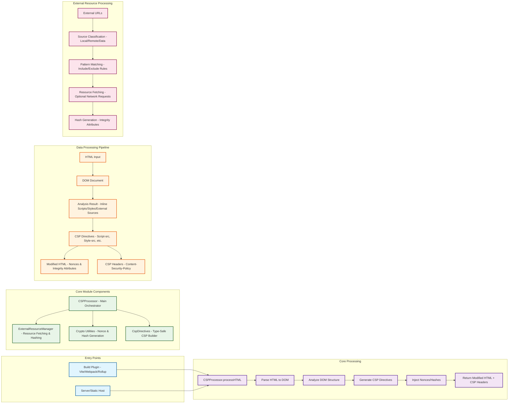

# CSP Core Module Flow and Usage Patterns

This diagram explains how the CSP Core Module works and the different ways it can be integrated into build processes.

## Architecture Overview



## Usage Patterns

### 1. Build Plugin Integration (Recommended)

**When to use:** During the build process when you have access to source files and build context.

**Benefits:**

  - Access to local file system
  - Can fetch and hash external resources
  - Generates integrity attributes
  - Optimized for build-time processing

**Example:**

```typescript
import { CSPProcessor } from '@csp-plugins/core';

const processor = new CSPProcessor({
 enableNonces: true,
 enableHashes: true,
 externalSources: {
  hashing: {
   scripts: true,
   styles: true,
   fetchExternal: true
  }
 }
});

// In your build plugin
const result = await processor.processHTML(htmlContent);
// result.html - Modified HTML with nonces
// result.headers - CSP headers for your server
```

### 2. Post-Build Processing (Runtime)

**When to use:** When you need to process HTML after it's been built, such as in a server or static hosting environment.

**Benefits:**

  - Works with any HTML output
  - Can handle dynamic content
  - No build tool dependencies

**Example:**

```typescript
import { CSPProcessor } from '@csp-plugins/core';

const processor = new CSPProcessor({
 enableNonces: true,
 enableHashes: true,
 externalSources: {
  hashing: {
   scripts: false, // Don't fetch external resources at runtime
   styles: false
  }
 }
});

// In your server
app.get('/', async(req, res) => {
 const html = await getBuiltHTML();
 const result = await processor.processHTML(html);
 res.set(result.headers);
 res.send(result.html);
});
```

## Key Components

### CSPProcessor

  - **Main orchestrator** that coordinates all CSP operations
  - **Build-time friendly** with external resource fetching capabilities
  - **Runtime safe** when external fetching is disabled

### ExternalResourceManager

  - **Source classification** (local, remote, data URLs)
  - **Pattern-based filtering** for include/exclude rules
  - **Resource fetching** with retry logic and caching
  - **Local file resolution** for build plugins

### Crypto Utilities

  - **Nonce generation** for inline scripts/styles
  - **Hash generation** for content integrity
  - **Cross-platform** (Node.js and browser compatible)

### CspDirectives

  - **Type-safe CSP directive building**
  - **Header generation** for server integration
  - **Policy validation** and error checking

## Configuration Options

### Build Plugin Optimizations

```typescript
{
  externalSources: {
    hashing: {
      scripts: true,
      styles: true,
      fetchExternal: true, // Enable for build-time
      integrity: true      // Add integrity attributes
    },
    resourceManager: {
      local: {
        resolver: (src, baseDir) => resolvePath(src, baseDir),
        exists: (path) => checkFileExists(path),
        reader: (path) => readFileContent(path)
      }
    }
  }
}
```

### Runtime Optimizations

```typescript
{
  externalSources: {
    hashing: {
      scripts: false,  // Disable external fetching
      styles: false,
      fetchExternal: false
    }
  },
  enableNonces: true,  // Still generate nonces
  enableHashes: true   // Still hash inline content
}
```

## Integration Points

### Build Tools

  - **Vite**: Use in `transformIndexHtml` hook
  - **Webpack**: Use in `HtmlWebpackPlugin` processing
  - **Rollup**: Use in `@rollup/plugin-html` processing
  - **Unplugin**: Create custom plugin wrapper

### Server Frameworks

  - **Express**: Set headers and serve modified HTML
  - **Fastify**: Use in response hooks
  - **Next.js**: Use in `getServerSideProps` or API routes
  - **Static Hosting**: Pre-process HTML files

This architecture allows you to choose the right integration pattern based on your build setup and runtime requirements.
